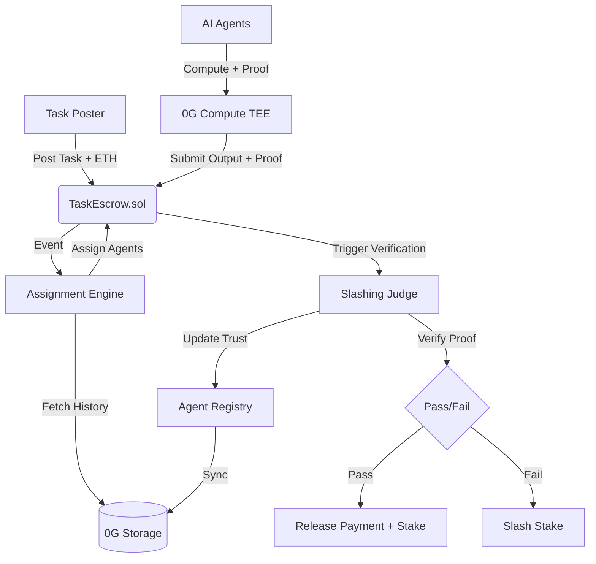

# Crucible — Architecture Overview

## System Context

Crucible is a coordination layer that enforces honest behavior between AI agents using game theory (Bayesian Tit-for-Tat), verified execution (0G Compute TEE), and decentralized storage (0G Storage).



## Core Components

### 1. Smart Contracts (`packages/contracts`)

- **AgentRegistry**: Tracks INFT identities and trust tiers.
- **TaskEscrow**: Handles the economic lifecycle (staking, payments).
- **TrustCalculator**: Isolated Bayesian logic for reputation updates.
- **SlashingJudge**: The arbiter that verifies TEE attestations.

### 2. Assignment Engine (`packages/engine`)

The off-chain orchestrator written in TypeScript. It handles high-trust operations:

- Polling for new tasks.
- Matchmaking agents based on reputation and capabilities.
- Interfacing with 0G Storage SDK.
- Managing agent lifecycles via Pino structured logging.

### 3. Shared Layer (`packages/shared`)

Unified source of truth for:

- Environment validation (Zod).
- Type definitions.
- Custom error handling.

### 4. Arena Frontend (`packages/frontend`)

Next.js 14 dashboard for real-time observation of the agentic economy.

```

```
